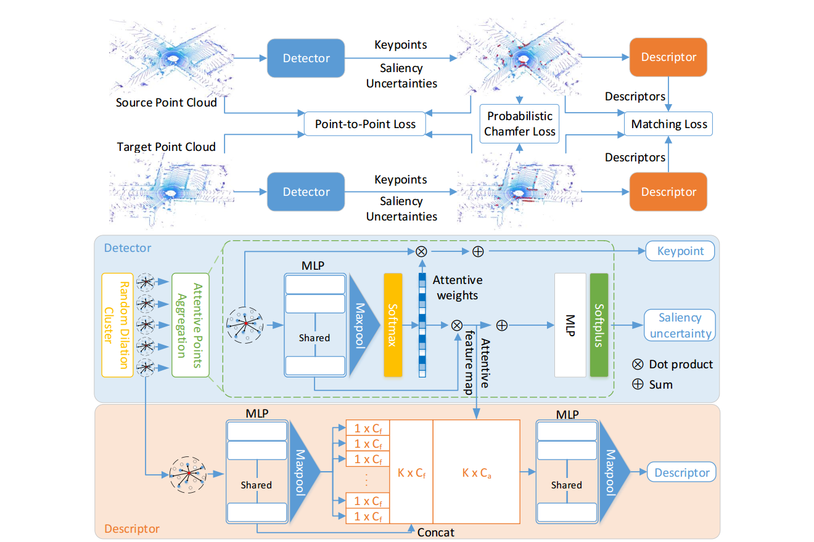

# RSKDD-Net: Random Sample-based Keypoint Detector and Descriptor

## Introduction

The repository contains the source code and pre-train model of our paper published on NeurIPS 2020: `RSKDD-Net: Random Sample-based Keypoint Detector and Descriptor`.

## Environment

Our code is developed and tested on the following environment:

- Python 3.6
- PyTorch 1.3.0 (also tested on 1.5.0)
- Cuda 10.1
- Numpy 1.18

[wandb](https://www.wandb.com/) is required to record the training procedure.

## Network

The network model is defined in models/models.py.

## Demo

We provides a pair of point clouds in KITTI dataset and Ford dataset in `demo/pc`, the pretrain model is stored in `pretrain`

Generates keypoints and descriptors of the sample data by run `python demo.py`

The keypoints and descriptors will be save in `demo/results/keypoints` and `demo/results/desc`. This step will cover the provided keypoints and descriptors.

`demo/demo_reg/demo_reg.m` is a matlab code to visualize registration of the sample pairs.

## Data preprocessing

We utilize [PCL](https://pointclouds.org/) to pre-process the input point clouds. The point cloud should be first downsampled using [VoxelGrid](https://pcl.readthedocs.io/en/latest/voxel_grid.html) filter and then extract normal and curvature using [NormalEstimation](https://pointclouds.org/documentation/tutorials/normal_estimation.html).

## Training

The network should be trained in two stages, 

- Firstly, train detector network using `sh train_detector.sh`, please change `DATA_DIR` to your own data.
- Secondly, train descriptor network using `sh train_descriptor.sh`, please change `DATA_DIR` to your own data and `PRETRAIN_DETECTOR_MODEL` to the correct path (based on the first step).

## Citation
If you use the code in your research, please cite as

Fan Lu, Guang Chen, Yinlong Liu, Zhongnan Qu, Alois Knoll. RSKDD-Net: Random Sample-based Keypoint Detector and Descriptor. In
*the 34th Conference on Neural Information Processing Systems* (NeurIPS 2020), Vancouver, Canada.

    @InProceedings{Lu_2020_NeurIPS,
        author = {Lu, Fan and Chen, Guang and Liu, Yinlong and Qu, Zhongnan and Knoll, Alois},
        title = {RSKDD-Net: Random Sample-based Keypoint Detector and Descriptor},
        booktitle = {The 34th Conference on Neural Information Processing Systems (NeurIPS)},
        month = {December},
        year = {2020}
    }

